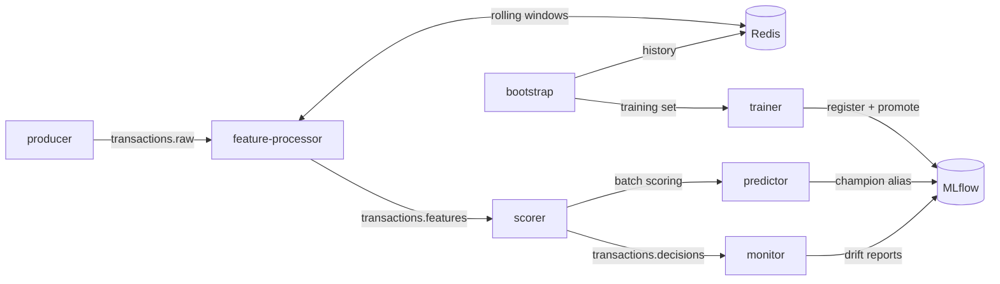
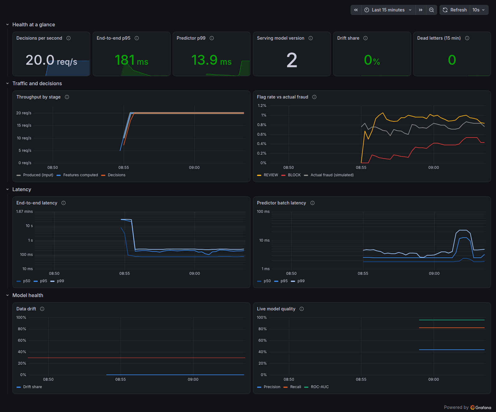
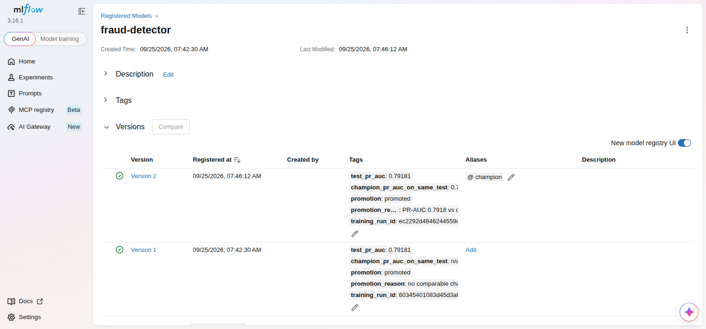
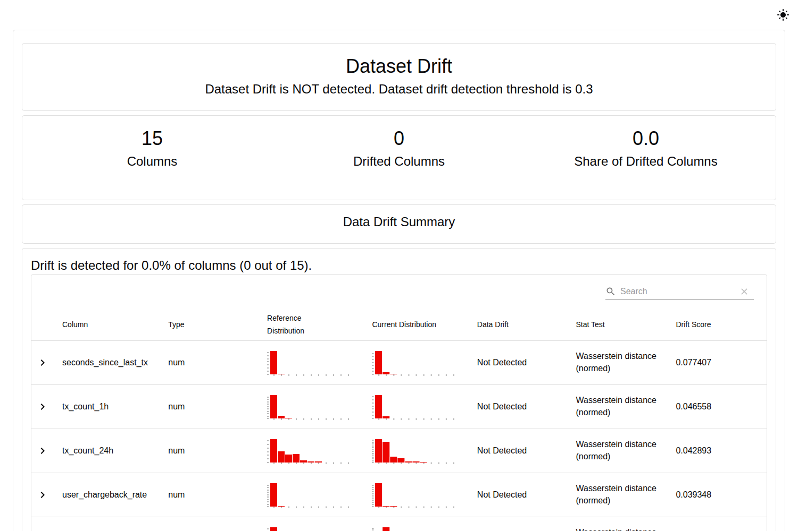

# Real-time fraud detection

[](https://github.com/Maxencejules/fraud_detection/actions/workflows/ci.yml)

A streaming fraud-detection system that scores card transactions as they happen. It
covers the whole path: simulated traffic, feature computation, scoring, model
training and rollout, and monitoring for drift. Everything runs locally with one
Docker Compose command.

- **Streaming features** in Kafka with exact event-time windows kept in Redis. The same
  code builds the training set, so training and serving cannot disagree.
- **A calibrated XGBoost + LightGBM model**, evaluated on a later time period than it
  was trained on, and promoted through an MLflow champion/challenger gate.
- **A FastAPI scoring service** that picks up newly promoted models without a restart.
- **A stream scorer** that publishes a decision (`APPROVE`, `REVIEW`, `BLOCK`) for every
  transaction.
- **Monitoring:** Evidently drift and live-quality reports, Prometheus metrics and a
  Grafana dashboard.

## Architecture



On start-up, `bootstrap` simulates 45 days of history through the production feature
code, which warms Redis and writes the training set. `trainer` then registers the first
champion model, and live traffic starts. The [architecture document](docs/architecture.md)
describes the design and the reasoning behind it.

## Quickstart

Requirements: Docker with Compose v2, 4 CPU cores and about 6 GB of memory for Docker
(the running stack uses about 4 GB; training briefly needs more).

```bash
docker compose up -d --build              # builds images, bootstraps, trains, starts
python3 scripts/smoke_test.py             # verifies the pipeline end to end
```

The first start takes about a minute after the images are built. Then open:

| What | Where |
|---|---|
| Scoring API (OpenAPI docs) | http://localhost:8000/docs |
| MLflow: runs, model registry, drift reports | http://localhost:5001 |
| Grafana dashboard (start with `--profile observability`) | http://localhost:3000 |
| Kafka UI (start with `--profile tools`) | http://localhost:8080 |

Score a transaction directly:

```bash
curl -s localhost:8000/v1/predict -H 'Content-Type: application/json' -d '{
  "transaction_id": "demo-1", "amount": 1899.0, "amount_log": 7.55, "amount_zscore": 12.4,
  "tx_count_1h": 4, "tx_count_24h": 5, "tx_sum_1h": 2410.0, "tx_sum_24h": 2455.0,
  "unique_merchants_24h": 4, "unique_countries_7d": 2, "seconds_since_last_tx": 95,
  "is_new_country": true, "hour_of_day": 3, "day_of_week": 6, "is_weekend": true,
  "card_present": false, "merchant_fraud_rate_30d": 0.09, "user_chargeback_rate": 0.0}'
```

The response contains `fraud_probability`, `decision`, `model_version` and `latency_ms`.
`POST /v1/predict/batch` scores up to 1,000 transactions per request.

## Results

Measured from a clean `docker compose up` with `HISTORY_END=1767225600`, which pins
the simulated history, so the dataset and model are reproducible. The model was
evaluated on the final six days of that history, 24,059 transactions of which 0.97% are
fraud; the model never saw that period during training. Full details are in the
[model card](docs/model-card.md).

| Model quality (test period) | |
|---|---|
| PR-AUC | **0.79** (95% CI 0.71–0.85) |
| ROC-AUC | 0.987 |
| Recall at a 1% false-positive rate | 0.85 |
| `REVIEW` or `BLOCK` (p ≥ 0.1) | precision 0.49, recall 0.80, 1.6% of traffic flagged |
| `BLOCK` (p ≥ 0.9) | precision 0.96, recall 0.47 |

| Latency and throughput | p50 | p95 | p99 |
|---|---|---|---|
| `/v1/predict`, one request at a time (server time) | 0.9 ms | 1.5 ms | 2.4 ms |
| `/v1/predict`, 8 concurrent clients (client time), 459 req/s | 16.2 ms | 23.7 ms | 35.3 ms |
| Producer → published decision, 20 transactions/s | 71 ms | 148 ms | 230 ms |

Batch scoring (`/v1/predict/batch`, 50 per request) sustained about 15,000
transactions/s. All figures come from a 4-vCPU virtual machine that also ran the entire stack
and the load generator, so treat them as an order of magnitude, not a capacity plan.
The raw results are in [`docs/results/`](docs/results/); reproduce them with
`make benchmark`.

For context, the previous version of this project reported a PR-AUC of 1.0. That
number came from synthetic data in which fraud and legitimate transactions were
perfectly separable (every fraud row had two or more countries and every legitimate
row exactly one), not from a model that works. The current simulator makes the
classes overlap, and evaluation uses a later time period than training.

## Screenshots

| Grafana: pipeline health | MLflow: model registry |
|---|---|
|  |  |



## Configuration

Every setting is an environment variable with a safe default; copy
[`.env.example`](.env.example) to `.env` to override them. The most useful ones:

| Variable | Default | Effect |
|---|---|---|
| `EMIT_RATE_TPS` | `20` | Simulated transactions per second. |
| `THRESHOLD_REVIEW`, `THRESHOLD_BLOCK` | `0.1`, `0.9` | Decision policy on the calibrated probability. |
| `HISTORY_DAYS`, `HISTORY_END` | `45`, now | Simulated history used for training and the Redis backfill. |
| `MODEL_POLL_INTERVAL_S` | `15` | How quickly the predictor adopts a new champion. |
| `ADMIN_TOKEN` | unset | Enables `POST /v1/admin/reload` (at least 16 characters). |
| `MONITOR_REPORT_INTERVAL_S` | `300` | Drift report frequency. |

Operational tasks (retraining, rollback, alerts, troubleshooting) are covered in the
[operations runbook](docs/operations.md).

## Development

The project is one installable package (`src/fraud_detection`) with one optional
dependency group per service, locked with [uv](https://docs.astral.sh/uv/).

```bash
uv sync --all-extras      # Python 3.12+, all dependencies
make check                # ruff, mypy --strict, unit tests (85% coverage gate)
make up smoke             # full stack and end-to-end check
make test-integration     # tests against the running stack
```

| Test layer | What it covers |
|---|---|
| Unit | Features, simulator, model, trainer, predictor API, every stream processor with Kafka test doubles. |
| Dependency boundaries | Each service imports with only its own dependency group installed. |
| Integration | Real Redis matches the offline feature store; a transaction flows from `transactions.raw` to a decision; malformed messages reach the DLQ; the champion loads from the registry. |
| End to end (CI) | Builds every image, runs the full stack, the smoke and integration tests and a benchmark. |

CI also enforces formatting, strict typing, a dependency vulnerability audit and
Python 3.12/3.13 compatibility. See [CONTRIBUTING.md](CONTRIBUTING.md).

```text
src/fraud_detection/
  simulation.py         synthetic users, merchants and fraud patterns
  features.py           event-time feature engineering over Redis
  bootstrap.py          history replay: training set and Redis backfill
  trainer.py            training, evaluation, registration, promotion
  modeling.py           calibrated ensemble packaged as an MLflow model
  predictor.py          FastAPI scoring service with hot model reload
  producer.py | feature_processor.py | scorer.py | monitor.py   stream services
infra/                  MLflow image, Prometheus and Grafana provisioning
scripts/                smoke test and benchmark
tests/                  unit and integration tests
docs/                   architecture, model card, operations, results
```

## Limitations

This is a demonstration system. A production deployment would change the following:

- **Data.** Transactions are simulated, so the model's quality says nothing about real
  fraud. Labels travel with the events; a real system receives chargebacks later through
  a separate feed.
- **Simulated time runs fast.** To produce enough traffic from a small population, a
  simulated day passes in minutes at the default rate. Features use event time, so
  results stay consistent, but event timestamps run ahead of the clock.
- **Infrastructure.** Single Kafka broker and Redis node, JSON without a schema
  registry, no TLS or authentication between services, development credentials.
- **Model governance.** Promotion is automatic when the quality gate passes; a real
  deployment would add shadow scoring, human sign-off and fairness checks on real data.

## License

Released under the [MIT License](LICENSE).
