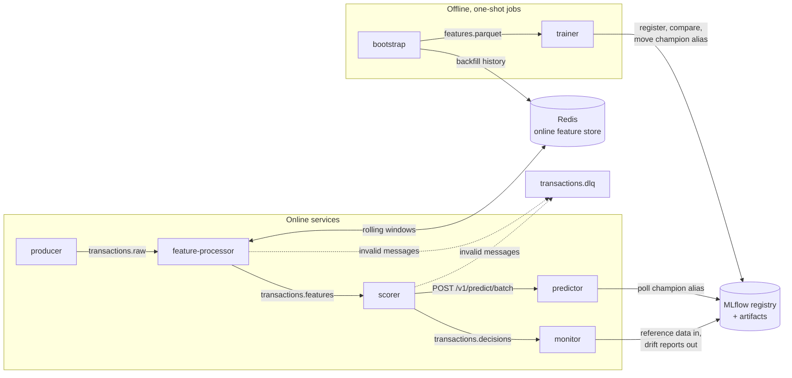

# Architecture

This document explains how the pipeline works and why it is built this way. For
running it, see the [README](../README.md) and the [operations runbook](operations.md);
for the model itself, see the [model card](model-card.md).

## Data flow



| Topic | Key | Payload (schema) | Written by | Read by |
|---|---|---|---|---|
| `transactions.raw` | `user_id` | `RawTransaction` | producer | feature-processor |
| `transactions.features` | `user_id` | `FeatureEvent` | feature-processor | scorer |
| `transactions.decisions` | `user_id` | `DecisionEvent` (features, probability, decision, model version) | scorer | monitor, any downstream system |
| `transactions.dlq` | original key | dead-letter envelope (stage, error, origin, payload) | feature-processor, scorer | operators |

All payloads are JSON validated by the Pydantic models in
[`schemas.py`](../src/fraud_detection/schemas.py). Keying by `user_id` keeps each user's
events in one partition, which gives the feature processor a single writer per user
and ordered processing of a user's history.

## Feature engineering

[`features.py`](../src/fraud_detection/features.py) turns a raw authorisation into the
17 model inputs. The same `FeatureEngineer` runs in the streaming feature processor
and in the offline backfill that produces the training set, so there is **no second
implementation of the features and no training/serving skew**. An integration test
checks that features computed against the real Redis match the in-memory emulation.

| Feature | Definition (all windows in event time) |
|---|---|
| `amount`, `amount_log` | Amount in USD and `ln(1 + amount)`. |
| `amount_zscore` | `(amount - mean) / max(std, 1)` over the user's *previous* transactions in the last 30 days; 0 with fewer than two; clipped to ±50. |
| `tx_count_1h`, `tx_count_24h` | The user's transactions in the last 1 h / 24 h, this one included. |
| `tx_sum_1h`, `tx_sum_24h` | Sum of amounts over the same windows. |
| `unique_merchants_24h` | Distinct merchants in the last 24 h. |
| `unique_countries_7d` | Distinct countries in the last 7 days. |
| `seconds_since_last_tx` | Time since the user's previous transaction (30 days if none). |
| `is_new_country` | Country absent from the user's previous 30 days (false without history). |
| `hour_of_day`, `day_of_week`, `is_weekend` | UTC calendar features of the event time. |
| `card_present` | Taken from the authorisation. |
| `merchant_fraud_rate_30d` | Confirmed-fraud share at the merchant over the 30 complete days whose labels are already known, smoothed towards a 1% prior (weight 50). |
| `user_chargeback_rate` | Confirmed-fraud share of the user's transactions in the 30 days that ended `label_delay` ago. |

### Design properties

- **Exact windows.** Each user has one sorted set scored by event time whose members
  encode `transaction_id|amount|merchant|country|timestamp`. One range query yields
  every per-user window. (The original implementation refreshed a TTL on every event,
  so its "24 h" and "30 d" windows never expired for active users.)
- **Delayed labels, no leakage.** Fraud labels (chargebacks) arrive after the
  transaction. Label-derived features only count transactions older than
  `LABEL_DELAY_SECONDS` (default 2 days), so a fraud burst cannot "see" the labels of
  its own earlier transactions. A unit test pins this behaviour.
- **Idempotent writes.** State changes are `ZADD`/`PFADD` of values derived from the
  transaction itself. Reprocessing a redelivered message leaves Redis unchanged and
  produces identical features, which makes at-least-once delivery safe.
- **One round trip per batch.** Writes never depend on computed features, so a whole
  consumed batch is pipelined into one Redis round trip while keeping sequential
  semantics. With `hiredis`, the processor handles ~6k events/s on one core
  (45 days of history for 3,000 users replay in about 50 s).
- **Daily merchant risk.** Merchant fraud rates use complete days whose labels are
  known, so they are final once computed and cached per merchant and day, the way
  production systems serve daily batch risk scores. Per-day counters are
  HyperLogLogs of transaction ids, which keeps them idempotent too. Counters are deleted
  63 days of event time after their day (30 days more than any feature reads), because
  simulated time runs far faster than their wall-clock TTL.
- **Cluster-ready keys.** Keys carry `{hash tags}` (`fd:u:{u000042}:tx`) so multi-key
  commands stay in one slot on Redis Cluster.

## Simulation

Real card data cannot be published, so [`simulation.py`](../src/fraud_detection/simulation.py)
generates it. It is a population model rather than independent random rows:

- 3,000 users with a home country, typical spend, favourite merchants and a
  card-present habit; transactions follow per-user Poisson processes with a daily
  cycle. Legitimate noise (travel, large purchases, online shopping) overlaps with
  fraud on purpose.
- **Account takeover:** bursts of card-not-present transactions minutes apart
  (optional low-value card testing, then high-value purchases), often from a country
  new to the user and at high-risk merchants. A small share of users is repeatedly
  victimised.
- **Opportunistic fraud:** single high-value card-not-present purchases.

Fraud is defined by *behaviour relative to the user's own history*. The fraudster's
country is drawn uniformly from countries other than the victim's, so no country is
associated with fraud.

The simulator runs in event time. The live producer paces events in wall-clock time
(`EMIT_RATE_TPS`), which speeds up simulated time (at 20 TPS a simulated day passes
in roughly four minutes). Features only ever use event time, so online and offline
behaviour stay identical. The producer checkpoints its simulation clock in Redis, so a
restart continues the timeline instead of replaying it. A checkpoint is saved only after
Kafka has acknowledged every event up to it, so events that were never delivered are not
skipped after a crash.

## Model lifecycle

```mermaid
sequenceDiagram
    participant B as bootstrap
    participant T as trainer
    participant R as MLflow registry
    participant P as predictor
    B->>T: features.parquet (history replayed through FeatureEngineer)
    T->>T: out-of-time split, fit XGBoost + LightGBM, calibrate on validation
    T->>R: log run, artifacts, reference data; register version N
    T->>R: score current champion on the same test period
    alt passes the quality gate and is not worse than the champion
        T->>R: set alias champion -> N
    else
        T->>R: set alias challenger -> N
    end
    loop every MODEL_POLL_INTERVAL_S
        P->>R: resolve champion alias
        P->>P: load new version, check feature contract, swap atomically
    end
```

- **Out-of-time evaluation.** Rows are ordered by event time. The first 10 days are
  dropped (rolling windows still filling), then the history is split 70/15/15 into
  train, validation and test. Random splits would put rows of the same fraud burst on
  both sides and inflate the metrics.
- **Model.** XGBoost and LightGBM with early stopping on validation PR-AUC (each keeps
  only the trees up to its best iteration), probabilities averaged. On the reference dataset the two tie on validation (0.766 vs 0.767 for the
  average), so no single-model selection is made on noise.
- **Calibration.** Platt scaling on the logit, fitted on the validation period. It is
  strictly monotone, so it never reorders transactions. Isotonic regression was
  evaluated and rejected: it collapsed ~24k distinct test scores into 47 plateaus,
  cost 0.028 PR-AUC and worsened log loss.
- **Packaging.** Artifacts are stored in native formats (XGBoost JSON, LightGBM text,
  calibration JSON), wrapped in an MLflow pyfunc logged with *models from code* so that
  standard MLflow tooling can serve it. The services never use that wrapper: they read
  the native files and the feature contract from `MLmodel` and build the scorer with
  the installed package's code. Loading a model therefore never executes code or
  unpickles objects from the registry. The predictor refuses a model whose features
  differ from its own.
- **Champion/challenger.** A new version only takes the `champion` alias if its test
  PR-AUC clears `MIN_PR_AUC` and is at least the champion's PR-AUC *on the same test
  period*. Rejected versions get the `challenger` alias. If the champion exists but
  cannot be loaded or scored (for example, the artifact store is unreachable),
  promotion is deferred: the new version also gets `challenger`, and nothing is
  promoted without the comparison. Rolling back means pointing the alias at a previous
  version; the predictor follows within one poll interval.

## Delivery semantics and failure handling

Every stream processor follows the same at-least-once protocol
([`kafka_utils.py`](../src/fraud_detection/kafka_utils.py)):

1. consume a batch with automatic offset storage disabled;
2. produce all outputs for the batch (including dead letters);
3. flush the producer and fail if any delivery was not acknowledged;
4. only then store the batch's offsets (committed asynchronously).

A crash before step 4 replays the batch; replays are harmless because feature state is
idempotent and decisions are keyed by `transaction_id`. Producers use idempotence and
`acks=all`.

| Failure | Behaviour |
|---|---|
| Malformed or invalid message | Published to `transactions.dlq` with stage, error and origin; the batch continues. |
| Producer cannot deliver | Clock checkpoints wait until Kafka acknowledges every event. The producer exits on a delivery failure, and after the restart resumes from the last acknowledged event time. |
| Redis or Kafka outage | Retried with capped exponential backoff, never dead-lettered; the process exits (and restarts) if the outage outlasts the retry budget, without committing. |
| Predictor unavailable (no model yet, restarting) | The scorer backs off and retries without committing: the stream pauses instead of dropping events. |
| Subscribed topic missing | Logged and retried. librdkafka reports this as a consumer error; the original consumer exited on it. |
| Fatal Kafka error | The process exits and Docker restarts it (`restart: unless-stopped`). |
| `SIGTERM` (e.g. `docker compose stop`) | Loops finish the current batch, flush, commit and close cleanly. |
| New model fails to load or breaks the contract | The predictor keeps serving the previous model, retries on every poll, and reports the error in `/ready` (`last_reload_error`), the logs and metrics. |

## Monitoring

- **Service metrics.** Every service exposes Prometheus metrics: throughput,
  dead letters, batch timings, predictor latency histograms, the served model version,
  end-to-end latency from producer to decision, drift share and live quality. The
  `observability` Compose profile adds Prometheus and a provisioned Grafana dashboard.
- **Model monitoring.** The monitor keeps a sliding window of decisions and compares
  it with the *champion's own reference data*: the held-out test period logged by the
  trainer together with the model's predictions on it. When the champion changes, the
  reference changes with it. Evidently computes per-column drift for the features and
  the score, and classification quality when the window contains both classes.
- **Calendar features are not drift-tested.** A window covers minutes of traffic while
  the reference covers days, so `hour_of_day`, `day_of_week` and `is_weekend` would
  always look drifted (a window holds one weekday and a few hours). The first reports
  showed exactly that: those three columns alone accounted for half of the 0.3 alarm
  threshold.
- **Artifact retention.** Every report logs its metrics and a compact JSON snapshot to
  MLflow. The full HTML report (~4 MB) is uploaded only when drift is detected or for
  the first report of a model version, and local copies are pruned to the newest 20.

## Security notes

- All host ports bind to `127.0.0.1`; Postgres is not published at all.
- Containers run as unprivileged users; images contain no compilers, credentials or
  local data (`.dockerignore` is an allow-list).
- The predictor has no admin API unless `ADMIN_TOKEN` (at least 16 characters) is set;
  the token is compared in constant time. CORS is off unless origins are configured.
  Internal errors return an opaque message with a request id.
- MLflow's host-header protection stays enabled with an explicit allow-list, and its
  usage telemetry is turned off.
- Models are loaded as data (native model files and YAML) with code from the installed
  package, so write access to the registry cannot run code in the services. It does
  still decide which model serves traffic, and the demo's MLflow has no authentication.
- CI pins third-party actions to commit SHAs, runs with read-only permissions and
  audits dependencies for known vulnerabilities.

This is a demonstration stack: service-to-service traffic is unauthenticated and
unencrypted, and credentials are development defaults. See the
[limitations](../README.md#limitations) for what a production deployment would add.

## Scaling

| Component | How it scales |
|---|---|
| feature-processor, scorer | Add replicas up to the partition count (6); users are sharded by key. |
| predictor | Stateless; run more replicas behind a load balancer. One process sustained ~460 req/s on a 4-vCPU host shared with the whole stack. |
| Redis | Keys are cluster-ready; per-user state is bounded by the 32-day retention. |
| monitor | One instance per model; windows are in memory and bounded. |
